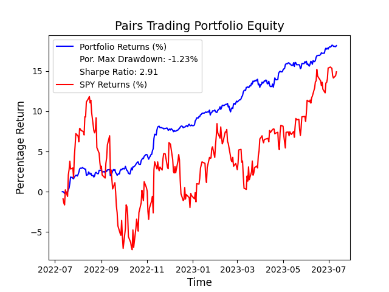

# Pairs Trading Strategy using Linear Regression

## Description
This is a pairs trading strategy that takes a basket of stock tickers in the form of a .csv file, reads the file and finds all the pairs of stocks that are cointegrated with a positive correlation and conducts a pairs trading strategy with buy and sell signals, as well as exit points.  The steps are: 
1. Find cointegrated pairs of stocks and check for positive correlation. Add them to a dictionary of stocks where key == stock1 and value == list of all stocks that are cointegrated with stock1.
2. Backtest pairs of stocks with backtesting.py package. 
  1. Calculate standardized spread of each pair of stocks using OLS. This spread follows a standard normal distribution: N(0, 1). This OLS also calculates the hedge ratio i.e. the slope of the regression line.
  2. Create an indicator using this spread.
  3. On each slice of data, check if spread > 1.5 or spread < -1.5
     - If spread > 1.5: long stock1 and short stock2.
     - If spread < -1.5: long stock2 and short stock1.
     - $Q_1 = \frac{cash}{100} \cdot (P_1 \cdot (1 + hedgeRatio))$
     - $Q_2 = \frac{cash \cdot hedgeRatio}{100} \cdot (P_2 \cdot (1 + hedgeRatio))$
  4. After backtesting each stock, will calculate the portfolio's cumulative returns, percentage returns and sharpe ratio, written to an output file. 

## How to run
To run the backtest, either give as input a .csv file to read the stock tickers and find cointegrating pairs of stocks, input a dictionary with all the pairs as key, value pairs as described above, or input a list of tuples of all the pairs. 
Then, just run: 
```python
python pairs.py
```
or 
```python
python3 pairs.py
```
depending on your IDE. 
The results will be outputted into a .txt file as described above, with each pairs' individual performance as well as the portfolio performance.

## Portfolio of pairs and results
After conducting my own research, I created a portfolio of 29 pairs of stocks (can be found at the end of the ReadMe file) that are cointegrated and positively correlated. After optimizing parameters, I found that the hourly resolution works best for this strategy. 
The results can be seen below: 

## Portfolio returns against SPY


## Portfolio of pairs
After conducting research on stocks and cryptocurrencies in the same industry, I arrived to this list of pairs of stocks and cryptos that are cointegrated with at least a correlation of 0.5. This way, we can ensure that our portfolio is very diversified and avoids large market downswings. 
```python(GOOG, AAPL)
(GOOG, AAPL)
(LINK-USD, ADA-USD)
(AXP, TSM)
(ACN, GOOG)
(VICI, VTR)
(VZ, TMUS)
(VZ, PARA)
(TMUS, T)
(TMUS, PARA)
(BBWI, BBY)
(BBWI, HD)
(CNC, DHR)
(CVS, DHR)
(HOLX, IDXX)
(ILMN, BMY)
(ILMN, CI)
(ILMN, CNC)
(ILMN, COO)
(ILMN, CRL)
(ILMN, CTLT)
(ILMN, CVS)
(ILMN, DHR)
(ILMN, GILD)
(ILMN, HCA)
(ILMN, HOLX)
(ILMN, HUM)
(ILMN, IDXX)
(DOT-USD, VET-USD)
(DOT-USD, XRP-USD)
(DOT-USD, XLM-USD)
(DOT-USD, VET-USD)
(DOT-USD, SOL-USD)
```